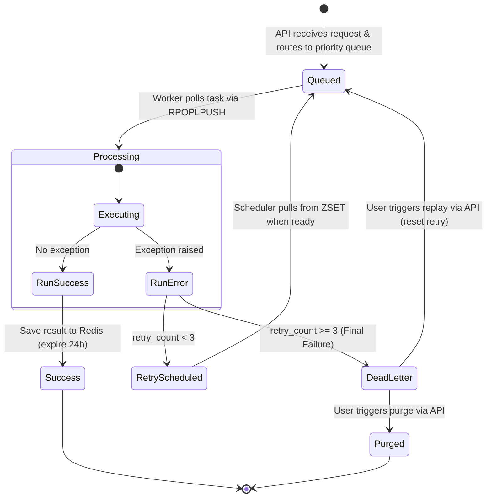

# PyTaskQ — High-Level System Architecture

This document provides a comprehensive overview of PyTaskQ: a custom, asynchronous Redis-backed multi-worker task queue implemented in this workspace.

---

## 1. System Overview

PyTaskQ is a lightweight, reliable multi-worker async task queue built in Python. It is designed to decouple heavy calculations (CPU-bound) and external integrations (I/O-bound) from the client-facing HTTP interface.

The architecture comprises three primary physical layers:
1. **Client / Frontend Interface**: A single-page dashboard serving as the control panel.
2. **API Server (FastAPI)**: An asynchronous web service that accepts task submissions, reports status/metrics, and manages failed tasks.
3. **Worker Daemon (Asyncio)**: A background execution engine that pulls tasks, runs them concurrently, coordinates retries, and records execution outcomes.

These components coordinate via a central **Redis** instance which acts as the message broker, state cache, and persistence layer.

(docs/images/architecture.svg)

---

## 2. Key Components

### A. API Server ([src/app.py])
Built using **FastAPI**, this service runs asynchronously under `uvicorn` and handles the following:
* **Task Ingestion**: 
  * Accepts task submissions via `POST /task/enqueue` with a JSON body specifying `task_name`, `args`, `priority`, and optional `webhook_url`.
  * Accepts delayed/scheduled tasks via `POST /task/schedule` with a `delay_seconds` parameter.
  * Generates a unique `task_id` (UUID v4) for each incoming request, attaches the caller's IP address (`client_ip`) for multi-tenancy, and routes the task to the appropriate priority queue (`queue:high`, `queue:default`, or `queue:low`).
* **Priority Routing**: Tasks are pushed into one of three Redis Lists based on their `priority` field. The worker always drains `queue:high` before looking at `queue:default`, and `queue:default` before `queue:low`.
* **Status Retrieval**: Exposes `GET /task/{task_id}` to fetch execution results or current state details.
* **Dead Letter Queue (DLQ) Management**: Provides endpoints to view (`GET /dlq`), replay (`POST /dlq/replay/{task_id}`), or delete (`POST /dlq/purge/{task_id}` & `POST /dlq/purge_all`) failed tasks. DLQ data is isolated per-IP (`dlq:{client_ip}`).
* **Queue Metrics**: Exposes `GET /metrics` returning per-user counts of pending, processing, delayed, DLQ, completed, and failed tasks — all keyed by the caller's IP.
* **Fault Tolerance**: Utilizes an exception handler for `RedisConnectionError` to gracefully return a HTTP `503 Service Unavailable` status when Redis is down.
* **Rate Limiting**: Per-IP rate limiting (10 requests per minute) using a Redis-backed sliding window counter.
* **Backpressure**: Global queue capacity check across all three priority queues to prevent unbounded growth.

### B. Redis Broker & Storage
Redis serves multiple roles utilizing different data structures:
1. **Priority Queues (`queue:high`, `queue:default`, `queue:low` — Lists)**: Three FIFO queues storing pending serialized tasks, consumed in strict priority order.
2. **Processing Queue (`processing_queue:{worker_id}` — List)**: Per-worker list storing tasks currently being processed. Acts as a backup for crash recovery.
3. **Delayed Tasks (`delayed_tasks` — Sorted Set / ZSET)**: Holds failed tasks waiting for retry schedules. The score is set to `current_epoch_time + backoff_delay_seconds`.
4. **Dead Letter Queue (`dlq:{client_ip}` — List)**: Per-tenant list storing tasks that have exceeded the maximum retry count of 3.
5. **Task Status Store (`Task id{task_id}` — Hash)**: Persistent storage for task execution state. Stores keys like `task_id`, `status` (`Success`, `RetryScheduled`, `DeadLetter`, `Failed`), `result` / `error`, and `retry_count`. Has a **24-hour expiration time (86,400s)**.
6. **Per-Tenant Stats Counters (`stats:{metric}:{client_ip}` — Strings)**: Atomic integer counters tracking `pending`, `processing`, `delayed`, `completed`, and `failed` per user IP.

### C. Worker Daemon ([src/worker.py])
An independent Python script executing on an **asyncio event loop**. It manages:
* **Priority-Based Job Consumption**: Polls the three priority queues in strict order using `RPOPLPUSH`: first `queue:high`, then `queue:default`, then `queue:low`. Each pop atomically moves the task into the worker's `processing_queue:{worker_id}` for crash safety. If all queues are empty, the worker sleeps for 1 second before polling again.
* **Concurrency Control**: Employs an `asyncio.Semaphore` capped at `10` concurrent tasks to limit system resource starvation.
* **Execution Dispatching**: Leverages execution pools depending on task specifications:
  * **CPU-bound tasks**: Dispatched to a `ProcessPoolExecutor` (configured with `max_workers=4`) to bypass the Python GIL and run tasks on separate CPU cores.
  * **I/O-bound tasks**: Dispatched to a `ThreadPoolExecutor` (configured with `max_workers=10`) to allow lightweight concurrent wait states without process overhead.
* **Retry Scheduler**: Runs a secondary async loop (`retry_scheduler`) that checks the `delayed_tasks` ZSET every second. Tasks whose scheduled time has passed are automatically moved back to their original priority queue for consumption.
* **Crash Recovery**: On startup, sweeps `processing_queue:{worker_id}` and pushes any leftover tasks to `queue:high` to ensure immediate reprocessing.
* **Zombie Sweeper**: Detects dead workers via heartbeat expiry and recovers their in-flight tasks to `queue:high`.

### D. Task Registry ([src/task_registery.py])
A decoupled repository for actual task execution logic:
* Defines [matrix_multiply] (generating two random arrays and computing dot products) and [send_email] (using `yagmail` to perform SMTP mail dispatching).
* Registers them under a central `TASKS` dictionary, enabling dynamic lookup at runtime by the Worker Daemon.

---

## 3. Detailed Data Flow & Task Lifecycle

The lifecycle of a single task progresses through well-defined states:

```mermaid
stateDiagram-v2
    [*] --> Queued : API receives request & routes to priority queue
    Queued --> Processing : Worker polls task via RPOPLPUSH
    
    state Processing {
        [*] --> Executing
        Executing --> RunSuccess : No exception
        Executing --> RunError : Exception raised
    }

    RunSuccess --> Success : Save result to Redis (expire 24h)
    Success --> [*]

    RunError --> RetryScheduled : retry_count < 3
    RunError --> DeadLetter : retry_count >= 3 (Final Failure)

    RetryScheduled --> Queued : Scheduler pulls from ZSET when ready
    DeadLetter --> Queued : User triggers replay via API (reset retry)
    DeadLetter --> Purged : User triggers purge via API
    Purged --> [*]
```

### Flow Walkthrough:
1. **Queueing**: A client calls `POST /task/enqueue` with a JSON body. The API generates a UUID, attaches the caller's IP, and pushes the task to the appropriate priority queue (`queue:high`, `queue:default`, or `queue:low`) via `LPUSH`.
2. **Reliable Fetch**: The Worker polls `RPOPLPUSH queue:{priority} processing_queue:{worker_id}` in strict priority order (high → default → low). The item is popped from the priority queue and instantly pushed to the processing queue. If the worker crashes immediately, the task remains inside the `processing_queue:{worker_id}`.
3. **Execution**:
   * The worker loads the task JSON and validates it via a Pydantic model (`Taskloader`).
   * The task is looked up in the `TASKS` registry.
   * If `task_type == "cpu"`, it executes inside `ProcessPoolExecutor`.
   * If `task_type == "io"`, it executes inside `ThreadPoolExecutor`.
4. **Resolution / Failures**:
   * **On Success**: The worker stores the result in a Redis hash `Task id{task_id}` with state `"Success"`, sets a 24h TTL, deletes the task from `processing_queue:{worker_id}` via `LREM`, increments `stats:completed:{client_ip}`, and releases the semaphore slot.
   * **On Failure**: The exception is caught. 
     * If `retry_count` is less than 3, the worker increments `retry_count`, calculates exponential backoff delay (`2 ** retry_count`), and saves the task to `delayed_tasks` (ZSET) with the scheduled time. It sets the Redis hash state to `"RetryScheduled"`.
     * If `retry_count` is 3, the task is moved directly to `dlq:{client_ip}`, and the Redis hash state is updated to `"DeadLetter"`.

---

## 4. Key Design Patterns & Resilience Features

### 1. Priority Queue Architecture
Three separate Redis Lists (`queue:high`, `queue:default`, `queue:low`) are polled in strict order. This ensures urgent tasks (e.g., emails, webhooks) are always processed before low-priority background work (e.g., matrix computations), without requiring complex sorted set logic.

### 2. Reliable Queueing (At-Least-Once Delivery)
By using `RPOPLPUSH` instead of a simple pop, the system guarantees that if a worker crashes, the task is not lost. 
During worker startup, a **crash recovery routine** sweeps `processing_queue:{worker_id}` and pushes any leftover tasks to `queue:high` to ensure immediate reprocessing.

### 3. Multi-Tenant Isolation
All metrics (`stats:pending:{ip}`, `stats:completed:{ip}`, etc.) and DLQ data (`dlq:{ip}`) are namespaced by the caller's IP address. Each user sees only their own data on the dashboard. The API extracts the true client IP from `X-Forwarded-For` headers to work correctly behind proxies like Docker, Ngrok, or Nginx.

### 4. Resilient Redis Reconnections
If Redis is down on worker startup, the worker logs the error and backs off for 5 seconds rather than crashing immediately. In the main loop, if a Redis operation fails, the semaphore slot is freed, and the worker sleeps before resuming.

### 5. Dedicated CPU vs I/O Pools
Python's GIL (Global Interpreter Lock) restricts standard multi-threaded Python programs from running CPU-intensive operations concurrently. 
* By running CPU tasks (`matrix_multiply`) inside a **`ProcessPoolExecutor`**, separate OS processes are spawned, utilizing multiple CPU cores.
* By running I/O tasks (`send_email`) inside a **`ThreadPoolExecutor`**, the worker is able to handle network latency and wait states efficiently without spawning heavy OS processes.

### 6. Graceful Shutdown
The worker registers signal handlers for `SIGINT` (Ctrl+C) and `SIGTERM`. When received:
1. `shutdown_event` is set, stopping the main consumption loop.
2. The worker waits for currently executing tasks to complete using `asyncio.gather(*active_tasks)`.
3. The executor pools are shutdown cleanly, and the Redis connection is closed.
