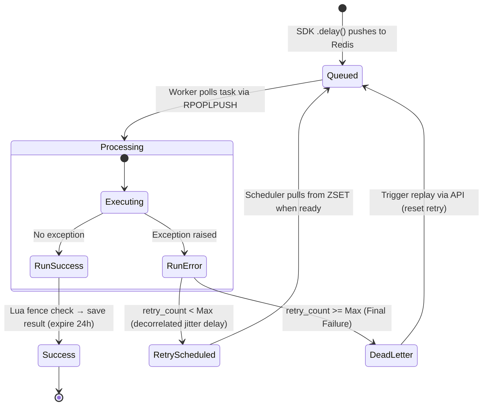

# PyTaskQ — High-Level System Architecture

This document provides a comprehensive overview of PyTaskQ: a highly scalable, asynchronous distributed task queue built natively for Python. 

---

## 1. System Overview

PyTaskQ is designed to decouple heavy calculations (CPU-bound) and external integrations (I/O-bound) from your main application thread. Instead of executing synchronously, tasks are sent to a background Redis queue and executed concurrently across a distributed fleet of worker nodes.

The architecture comprises three primary physical layers:
1. **The SDK Interface**: A native Python library that decorates functions and seamlessly injects `.delay()` and `.schedule()` methods, pushing tasks directly to Redis.
2. **Worker Daemon (CLI)**: A background execution engine (`pytaskq worker --app`) that pulls tasks, runs them concurrently, coordinates retries, and handles crash recovery.
3. **API & Dashboard**: A lightweight FastAPI service providing metrics, Dead Letter Queue (DLQ) visibility, and a real-time React dashboard.

These components coordinate via a central **Redis** instance which acts as the message broker, state cache, and persistence layer.

---

## 2. Key Components

### A. The Python SDK (`pytaskq.task_registery`)
Tasks are registered natively in Python code, completely bypassing the need for a bloated HTTP API to enqueue jobs.

*   **Registration**: Developers use the `@queue.task()` decorator to register their functions.
*   **Enqueuing**: Calling `await my_task.delay(args)` pushes a JSON payload directly into a Redis `queue:priority` List via an atomic pipeline. 
*   **Scheduling**: Calling `await my_task.schedule(delay_seconds=60)` pushes the payload into the `delayed_tasks` Sorted Set.

### B. Redis Broker & Storage
Redis serves multiple roles utilizing different data structures:
1. **Priority Queues (`queue:high`, `queue:default`, `queue:low` — Lists)**: Three FIFO queues storing pending serialized tasks, consumed in strict priority order.
2. **Processing Queue (`processing_queue:{worker_id}` — List)**: Per-worker list storing tasks currently being processed. Acts as a backup for crash recovery.
3. **Delayed Tasks (`delayed_tasks` — Sorted Set / ZSET)**: Holds scheduled and failed tasks waiting for retry schedules. The score is set to `current_epoch_time + delay_seconds`.
4. **Dead Letter Queue (`dlq` — List)**: A global list storing tasks that have exceeded the maximum retry limit.
5. **Task Status Store (`task:{task_id}` — Hash)**: Persistent storage for task execution state. Stores status, result, or error. Has a **24-hour expiration time (86,400s)**.
6. **Fence Tokens (`fence:{task_id}` — String)**: Monotonic per-task token; the value is checked atomically inside a Lua fencing script before a result is written.
7. **Worker Registry (`active_workers` — ZSET)**: Heartbeat lease — score is the expiry timestamp; the zombie sweeper recovers tasks of expired workers.

### C. Worker Daemon CLI (`pytaskq/cli.py` & `pytaskq/worker.py`)
The Worker runs as an independent daemon executing on an **asyncio event loop**.

*   **Dynamic Loading**: The CLI uses `importlib` to dynamically import the developer's application code (e.g., `--app main:queue`). This injects the developer's registered tasks into the worker process.
*   **Priority-Based Job Consumption**: Polls the three priority queues in strict order using `RPOPLPUSH`. Each pop atomically moves the task into the worker's `processing_queue:{worker_id}` for crash safety. 
*   **Execution Dispatching**: Leverages execution pools depending on task specifications:
    *   **CPU-bound tasks**: Dispatched to a `ProcessPoolExecutor` to bypass the Python GIL and run tasks on separate CPU cores.
    *   **I/O-bound tasks**: Dispatched to a `ThreadPoolExecutor` to allow lightweight concurrent wait states without process overhead.
*   **Fencing Tokens**: Before saving a result, the worker runs a Lua script (`EVAL`) that atomically checks the task's fence token. A stale worker whose task was re-assigned loses the write — its result is discarded.
*   **Distributed Cron (Beat)**: Workers calculate `croniter` timestamps for tasks registered with a `cron` expression. It uses a distributed Redis lock (`SET NX EX`) so that only one worker node enqueues the cron job at the specific tick.
*   **Retry Backoff**: Decorrelated jitter (AWS Strategy 3) — `delay = min(30, uniform(1, prev*3))`. 
*   **Zombie Sweeper**: Detects dead workers via heartbeat expiry, recovers their in-flight tasks to `queue:high`, and **bumps each task's fence token** so the dead worker (if it revives) can't overwrite the fresh attempt's result.

---

## 3. Detailed Data Flow & Task Lifecycle

The lifecycle of a single task progresses through well-defined states:

## 4. Fault Tolerance Scenarios

| Failure Scenario | Mitigation Mechanism |
| :--- | :--- |
| **Worker OOM/Power Loss (Hard Crash)** | `RPOPLPUSH` atomic move places the task in `processing_queue:{worker_id}`. The **Zombie Sweeper** detects the missed heartbeat, moves the task back to `queue:high`, and bumps the fence token. |
| **Task Hangs Indefinitely (Timeout)** | `asyncio.wait_for` wraps execution with `TASK_TIMEOUT`. On timeout, the fence token is bumped in Redis. If the hung task ever finishes, its Lua write attempt fails. |
| **Two Workers Run the Same Task** | Only possible via crash recovery. The second worker gets the bumped fence token. The original (hung/slow) worker retains the old token. The Lua script guarantees only the second worker's write succeeds. |
| **Redis Goes Down** | FastAPI routes and Worker polling loops use broad `try/except` with a 5-second backoff sleep. The system gracefully pauses until Redis comes back online. |
