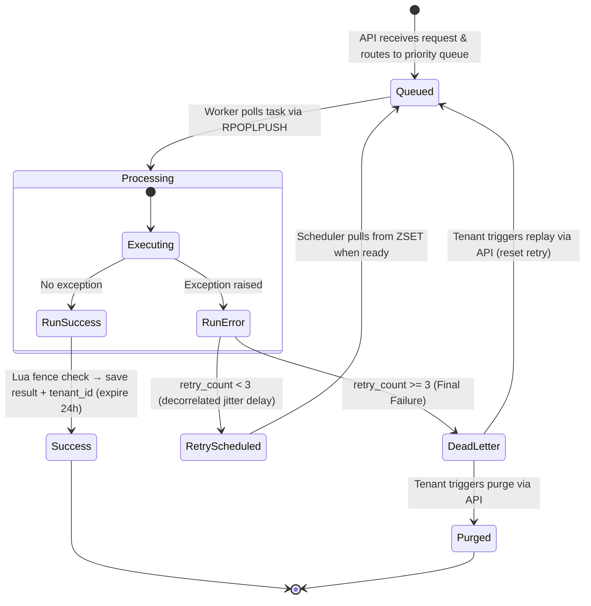

# PyTaskQ — High-Level System Architecture

This document provides a comprehensive overview of PyTaskQ: a custom, asynchronous Redis-backed multi-worker task queue implemented in this workspace.

---

## 1. System Overview

PyTaskQ is a lightweight, reliable multi-worker async task queue built in Python. It is designed to decouple heavy calculations (CPU-bound) and external integrations (I/O-bound) from the client-facing HTTP interface.

The architecture comprises three primary physical layers:
1. **Client / Frontend Interface**: A single-page dashboard serving as the control panel.
2. **API Server (FastAPI)**: An asynchronous web service that accepts task submissions, reports status/metrics, and manages failed tasks.
3. **Worker Daemon (Asyncio)**: A background execution engine that pulls tasks, runs them concurrently, coordinates retries, and records execution outcomes.

These components coordinate via a central **Redis** instance which acts as the message broker, state cache, and persistence layer.

(docs/images/architecture.svg)

---

## 2. Key Components

### A. API Server ([src/app.py](../src/app.py))
Built using **FastAPI**, this service runs asynchronously under `uvicorn` and handles the following:
* **Task Ingestion**:
  * Accepts task submissions via `POST /task/enqueue` with a JSON body specifying `task_name`, `args`, `priority`, and an optional `idempotency_key`.
  * Accepts delayed/scheduled tasks via `POST /task/schedule` with a `delay_seconds` parameter.
  * Generates a unique `task_id` (UUID v4) for each incoming request and routes the task to the appropriate priority queue (`queue:high`, `queue:default`, or `queue:low`).
* **Priority Routing**: Tasks are pushed into one of three Redis Lists based on their `priority` field. The worker always drains `queue:high` before looking at `queue:default`, and `queue:default` before `queue:low`.
* **Status Retrieval**: Exposes `GET /task/{task_id}` to fetch execution results or current state details. **Tenant-isolated**: results written without a matching `tenant_id` are unreachable (403) — the endpoint fails closed.
* **Dead Letter Queue (DLQ) Management**: Provides endpoints to view (`GET /dlq`), replay (`POST /dlq/replay/{task_id}`), or delete (`POST /dlq/purge/{task_id}` & `POST /dlq/purge_all`) failed tasks. DLQ data is isolated per-tenant (`dlq:{tenant_id}`).
* **Queue Metrics**: Exposes `GET /metrics` returning per-tenant counts of pending, processing, delayed, DLQ, completed, and failed tasks, plus per-priority queue depths and live worker count.
* **Fault Tolerance**: Utilizes an exception handler for `RedisConnectionError` to gracefully return a HTTP `503 Service Unavailable` status when Redis is down.
* **Rate Limiting**: Per-tenant rate limiting using a Redis-backed fixed-window counter. The limit is **env-configurable** via `RATE_LIMIT_PER_MINUTE` (default 100/min) — the enforcer and the `/metrics` reporter read the same constant so they can never disagree.
* **Backpressure**: Global queue capacity check across all three priority queues (env: `QUEUE_CAPACITY`) to prevent unbounded growth.
* **Idempotency (two layers)**:
  * *Layer 1*: client-supplied `Idempotency-Key` (header or body) — `SET NX EX` claims the key; duplicates within the TTL get the cached response replayed.
  * *Layer 2*: content-hash safety net (task_name + args + tenant) — identical resubmits within 5 seconds get `409 Conflict`.
  * Idempotent retries do **not** consume rate-limit slots (the counter increments only after the dedup check passes).
* **Real-time Dashboard**: `WS /ws/dashboard` — Redis Pub/Sub per tenant (`events:{tenant_id}`) wakes a pusher task; 30s heartbeat fallback; clients may "track" up to 10 task IDs.

### B. Redis Broker & Storage
Redis serves multiple roles utilizing different data structures:
1. **Priority Queues (`queue:high`, `queue:default`, `queue:low` — Lists)**: Three FIFO queues storing pending serialized tasks, consumed in strict priority order.
2. **Processing Queue (`processing_queue:{worker_id}` — List)**: Per-worker list storing tasks currently being processed. Acts as a backup for crash recovery.
3. **Delayed Tasks (`delayed_tasks` — Sorted Set / ZSET)**: Holds failed tasks waiting for retry schedules. The score is set to `current_epoch_time + backoff_delay_seconds`.
4. **Dead Letter Queue (`dlq:{tenant_id}` — List)**: Per-tenant list storing tasks that have exceeded the maximum retry count of 3.
5. **Task Status Store (`task:{task_id}` — Hash)**: Persistent storage for task execution state. Stores `task_id`, `status` (`Success`, `RetryScheduled`, `DeadLetter`, `Failed`), `result` / `error`, **`tenant_id`** (written on every path — success, retry, DLQ — so reads can enforce isolation), and `retry_count`. Has a **24-hour expiration time (86,400s)**.
6. **Fence Tokens (`fence:{task_id}` — String)**: Monotonic per-task token; the value is checked atomically inside the Lua fencing script before a result is written.
7. **Worker Registry (`active_workers` — ZSET)**: Heartbeat lease — score is the expiry timestamp; the zombie sweeper recovers tasks of expired workers.
8. **Per-Tenant Stats Counters (`stats:{metric}:{tenant_id}` — Strings)**: Atomic integer counters tracking `pending`, `processing`, `delayed`, `completed`, `failed`, and `dlq` per tenant.
9. **Tenancy Records**: `api_key:{key}` hashes (key → tenant_id) and `webhook:{tenant_id}` hashes (registered webhook URL + HMAC secret).

### C. Worker Daemon ([src/worker.py](../src/worker.py))
An independent Python script executing on an **asyncio event loop**. It manages:
* **Priority-Based Job Consumption**: Polls the three priority queues in strict order using `RPOPLPUSH`: first `queue:high`, then `queue:default`, then `queue:low`. Each pop atomically moves the task into the worker's `processing_queue:{worker_id}` for crash safety. If all queues are empty, the worker sleeps for 1 second before polling again.
* **Concurrency Control**: Employs an `asyncio.Semaphore` capped at `10` concurrent tasks to limit system resource starvation.
* **Execution Dispatching**: Leverages execution pools depending on task specifications:
  * **CPU-bound tasks**: Dispatched to a `ProcessPoolExecutor` (configured with `max_workers=4`) to bypass the Python GIL and run tasks on separate CPU cores.
  * **I/O-bound tasks**: Dispatched to a `ThreadPoolExecutor` (configured with `max_workers=10`) to allow lightweight concurrent wait states without process overhead.
* **Fencing Tokens**: Before saving a result, the worker runs a Lua script (`EVAL`) that atomically checks the task's fence token and writes the result (including `tenant_id`) only if the token still matches. A stale worker whose task was re-assigned loses the write — its result is discarded.
* **Retry Scheduler**: Runs a secondary async loop (`retry_scheduler`) that checks the `delayed_tasks` ZSET every second. Tasks whose scheduled time has passed are moved back to their original priority queue.
* **Retry Backoff**: Decorrelated jitter (AWS Strategy 3) — `delay = min(30, uniform(1, prev*3))`. The previous delay (`prev_delay`) travels **inside the task payload**, so the widening window survives Redis round-trips.
* **Task Timeout**: Every execution is wrapped in `asyncio.wait_for(exec_future, TASK_TIMEOUT)` (env, default 300s). `wait_for` cannot kill a running thread/process, so on expiry the worker **bumps the task's fence token** — whenever the orphaned handler eventually finishes, its result write fails the fence check and is discarded. This is the anti-deadlock guarantee: a hung task costs one slot for at most `TASK_TIMEOUT` seconds, never forever. Set `TASK_TIMEOUT=0` to disable for legitimately long tasks.
* **Crash Recovery**: On startup, sweeps `processing_queue:{worker_id}` and pushes any leftover tasks to `queue:high` to ensure immediate reprocessing.
* **Zombie Sweeper**: Detects dead workers via heartbeat expiry, recovers their in-flight tasks to `queue:high`, and **bumps each task's fence token** so the dead worker (if it revives) can't overwrite the fresh attempt's result.
* **Webhook Delivery**: On task success, if the tenant has a webhook registered, the worker enqueues a dedicated `_deliver_webhook` task — delivery itself is retryable and hits the DLQ after 3 failures.

### D. Task Registry ([src/task_registery.py](../src/task_registery.py))
A decoupled repository for actual task execution logic:
* **SSRF guard**: `_assert_safe_url()` validates every user-supplied URL before any fetch — scheme allowlist (http/https), hostname blocklist (localhost/.internal/.local), DNS resolution checked against loopback / link-local (cloud metadata `169.254.169.254`) / RFC1918 private / reserved / multicast ranges. A custom redirect handler re-validates every hop.
* **Handlers**: `matrix_multiply` (NumPy `np.dot` — vectorized, GIL-releasing), `generate_csv_report` (in-memory CSV), `resize_image` (in-memory download capped at 10 MB, Pillow resize, no disk writes), `url_health_check`, `_deliver_webhook` (HMAC-SHA256-signed POST).
* Registers them under a central `TASKS` dictionary (`name → {handler, type}`), enabling dynamic lookup at runtime by the Worker Daemon. The API never needs to know how a task executes.

---

## 3. Detailed Data Flow & Task Lifecycle

The lifecycle of a single task progresses through well-defined states:

### Flow Walkthrough:
1. **Queueing**: A client calls `POST /task/enqueue` with a JSON body and `Authorization: Bearer <api_key>`. The API resolves the tenant, passes the two-layer idempotency check, generates a UUID, and pushes the task (carrying `tenant_id`) to the appropriate priority queue via `LPUSH`.
2. **Reliable Fetch**: The Worker polls `RPOPLPUSH queue:{priority} processing_queue:{worker_id}` in strict priority order. If the worker crashes immediately, the task remains inside `processing_queue:{worker_id}`.
3. **Execution**:
   * The worker validates the task JSON via Pydantic (`Taskloader`).
   * The task is looked up in the `TASKS` registry.
   * If `task_type == "cpu"`, it executes inside `ProcessPoolExecutor`; `"io"` → `ThreadPoolExecutor`.
4. **Resolution / Failures**:
   * **On Success**: The Lua fencing script atomically writes the result **with `tenant_id`** into the `task:{task_id}` hash (24h TTL), the worker increments `stats:completed:{tenant_id}`, removes the task from its processing queue via `LREM`, and releases the semaphore slot. A registered webhook is enqueued as its own task.
   * **On Failure**: The exception is caught.
     * If `retry_count` is less than 3, the worker increments `retry_count`, computes a **decorrelated-jitter** delay, saves the task to `delayed_tasks` (ZSET), and sets the hash state to `RetryScheduled` (with `tenant_id`).
     * If `retry_count` is 3, the task is moved to `dlq:{tenant_id}` and the hash state becomes `DeadLetter` (with `tenant_id`).

---

## 4. Key Design Patterns & Resilience Features

### 1. Priority Queue Architecture
Three separate Redis Lists (`queue:high`, `queue:default`, `queue:low`) are polled in strict order. This ensures urgent tasks (e.g., emails, webhooks) are always processed before low-priority background work (e.g., matrix computations), without requiring complex sorted set logic.

### 2. Reliable Queueing (At-Least-Once Delivery)
By using `RPOPLPUSH` instead of a simple pop, the system guarantees that if a worker crashes, the task is not lost.
During worker startup, a **crash recovery routine** sweeps `processing_queue:{worker_id}` and pushes any leftover tasks to `queue:high`. At runtime, the **zombie sweeper** does the same for *dead* workers detected via heartbeat expiry.

### 3. Fencing Tokens (Stale-Write Protection)
Recovery + at-least-once delivery means two workers may briefly execute the same task. The Lua `EVAL` fence check makes the result write conditional on the task's current fence token: recovered tasks get their token bumped, so the older execution's write is rejected. This is the pattern Martin Kleppmann recommends for distributed locks ("How to do distributed locking").

### 4. Multi-Tenant Isolation
All metrics (`stats:pending:{tenant_id}`, etc.), DLQ data (`dlq:{tenant_id}`), and task results are namespaced per tenant. Tenants authenticate with API keys issued via master-key-protected admin routes. `GET /task/{task_id}` **fails closed**: a missing or mismatched `tenant_id` on the stored hash yields 403, never a cross-tenant read.

### 5. Idempotency-Aware Intake
Layer-1 keys (client-supplied) and layer-2 content hashes (automatic) prevent duplicate execution from client retries; the rate limiter counts only confirmed-fresh requests.

### 6. SSRF Protection
Workers fetch user-supplied URLs (image resize, health checks). Every URL passes DNS-based validation rejecting private/loopback/link-local/reserved targets, with per-redirect re-validation and a download size cap.

### 7. Resilient Redis Reconnections
If Redis is down on worker startup, the worker logs the error and backs off for 5 seconds rather than crashing immediately. In the main loop, if a Redis operation fails, the semaphore slot is freed, and the worker sleeps before resuming. The API surfaces Redis outages as clean `503` responses.

### 8. Dedicated CPU vs I/O Pools
Python's GIL restricts standard multi-threaded Python programs from running CPU-intensive operations concurrently.
* By running CPU tasks (`matrix_multiply`) inside a **`ProcessPoolExecutor`**, separate OS processes are spawned, utilizing multiple CPU cores.
* By running I/O tasks (`url_health_check`, webhook delivery) inside a **`ThreadPoolExecutor`**, the worker handles network latency and wait states efficiently without spawning heavy OS processes.

### 9. Observability
OpenTelemetry spans are created at enqueue (`pytaskq-api`) and execution (`pytaskq-worker`); W3C trace context travels inside the task payload (`trace_carrier`), so one trace spans HTTP → Redis → worker in Jaeger.

### 10. Graceful Shutdown
The worker registers signal handlers for `SIGINT` (Ctrl+C) and `SIGTERM`. When received:
1. `shutdown_event` is set, stopping the main consumption loop.
2. The worker waits for currently executing tasks to complete using `asyncio.gather(*active_tasks)`.
3. The executor pools are shutdown cleanly, and the Redis connection is closed.
4. Remaining OTel spans are force-flushed.

---

## 5. Configuration Reference

All runtime configuration is environment-driven (see `.env.example`):

| Variable | Default | Purpose |
|---|---|---|
| `REDIS_HOST` / `REDIS_PORT` | localhost / 6379 | Redis connection |
| `QUEUE_CAPACITY` | 500 | Backpressure threshold (3 queues combined) |
| `RATE_LIMIT_PER_MINUTE` | 100 | Per-tenant request limit — enforced AND reported |
| `TASK_TIMEOUT` | 300 | Hard wall-clock limit per task (seconds). On expiry the fence token is bumped so late results are discarded. `0` disables |
| `MASTER_KEY` | *(empty)* | Protects `/admin/keys/*`; empty disables admin routes |
| `ALLOWED_ORIGINS` | * | CORS allowlist |
| `ENVIRONMENT` | development | `production` hides /docs and /redoc |
| `IDEMPOTENCY_TTL` | 86400 | Layer-1 key cache window |
| `DEDUP_TTL` | 5 | Layer-2 content-hash window |
| `LOADTEST_HOST` / `LOADTEST_API_KEY` | localhost:8000 / empty | Locust target config |

**Persistence (in place)**: Redis runs with AOF enabled (`appendfsync everysec` — at most ~1s of accepted tasks lost on a crash; see `redis.conf`) plus RDB snapshots, and the compose stack mounts a `redis-data` volume. Queued tasks now survive a Redis restart.

**Remaining limitation**: Redis is still a single *availability* point (one master). The HA path is Sentinel (the `redis-py` client in use supports it natively), with idempotency keys already in place to deduplicate any failover-window re-deliveries. Tracked in [SCALING_ARCHITECTURE.md](SCALING_ARCHITECTURE.md).
